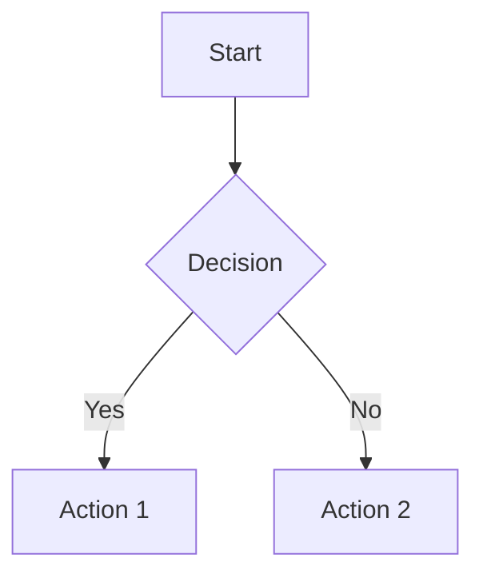

# Quarkdown User Guide

<p align="center">
<picture>
  <source media="(prefers-color-scheme: dark)" srcset="https://raw.githubusercontent.com/iamgio/quarkdown/project-files/images/tbanner-light.svg">
  <source media="(prefers-color-scheme: light)" srcset="https://raw.githubusercontent.com/iamgio/quarkdown/project-files/images/tbanner-dark.svg">
  
</picture>
</p>

---

## Table of Contents

1. [Welcome to Quarkdown](#welcome-to-quarkdown)
2. [Getting Started](#getting-started)
3. [Markdown Enhancements](#markdown-enhancements)
4. [Functions and Syntax](#functions-and-syntax)
5. [Document Setup and Configuration](#document-setup-and-configuration)
6. [Layout and Design](#layout-and-design)
7. [Scripting and Control Flow](#scripting-and-control-flow)
8. [Charts and Diagrams](#charts-and-diagrams)
9. [Text and Content Manipulation](#text-and-content-manipulation)
10. [File Operations](#file-operations)

---

## Welcome to Quarkdown

Welcome to the Quarkdown wiki! This guide is designed to be ***complementary* to the project documentation**, available at [quarkdown.com/docs](https://quarkdown.com/docs/quarkdown-stdlib).

- The documentation provides comprehensive details about functions, their input and their output
- This guide is a user-centered collection of features and their use cases

### Other Resources

- [README](/iamgio/quarkdown/blob/main/README.md#installation) for installation and getting started
- [Discussions](/iamgio/quarkdown/discussions) to ask questions and show your creations
- [quarkdown-test](/iamgio/quarkdown/tree/main/quarkdown-test/src/test/kotlin/com/quarkdown/test): this module tests the correct output of full Quarkdown programs, so you can find useful and complete examples here
- Since the Quarkdown flavor is an extension of CommonMark/GFM, guides here won't cover standard Markdown syntax. Please refer to other resources, such as [markdownguide ↗](https://www.markdownguide.org/basic-syntax), to know more about Markdown

---

## Getting Started

### Document Metadata

Set metadata for your document using the following patterns:

```yaml
---
title: My Document
author: John Doe
date: 2024-01-01
---
```

Document metadata helps with PDF export and provides context for your documents.

### Including Other Quarkdown Files

Use `.include` to include other Quarkdown files:

```
.include {path/to/file.qmd}
```

This enables modular document composition and code reuse.

---

## Markdown Enhancements

### Figures

Quarkdown introduces the concept of **figure**, which is missing in base Markdown. A figure wraps an image and is horizontally centered.

If a paragraph only consists of a single image (isolated image), then it becomes a figure.

```markdown
Lorem ipsum dolor sit amet, consectetur adipiscing elit.


Lorem ipsum dolor sit amet, consectetur adipiscing elit.
```

If the image contains a *title* attribute (wrapped in double quotes, single quotes or parentheses), it is displayed as a caption.

```markdown

```

### Image Size

Control image dimensions with size attributes:

```markdown
{width=50% height=200px}
```

### TeX Formulas

Write mathematical formulas using TeX syntax:

```latex
$$\int_{-\infty}^{\infty} e^{-x^2} dx = \sqrt{\pi}$$
```

Inline formulas: `$E = mc^2$`

### Table Caption

Add captions to tables:

```markdown
| Column 1 | Column 2 |
|----------|----------|
| Data 1   | Data 2   |

Table: This is my table caption
```

### Quote Types (Alerts)

Create different types of alerts:

```markdown
> [!NOTE]
> This is a note

> [!WARNING]
> This is a warning

> [!IMPORTANT]
> This is important information
```

### Quotation Source

Add sources to quotes:

```markdown
> "The only way to do great work is to love what you do."
> 
> — Steve Jobs
```

### Page Breaks

Insert page breaks for PDF output:

```
.pagebreak
```

### Text Symbols

Replace text with symbols automatically:

- `->` becomes →
- `<-` becomes ←
- `...` becomes …
- `(c)` becomes ©

---

## Functions and Syntax

### Syntax of a Function Call

Functions in Quarkdown follow this pattern:

```
.functionName {parameter1} {parameter2}
```

#### Block vs. Inline Function Calls

**Inline calls** are on a single line:
```
.bold {Hello World}
```

**Block calls** span multiple lines:
```
.container
  This is content
  inside a container
```

#### Chaining Calls

Chain functions using the `::` operator:

```
.text {Hello}::upper::bold
```

### Declaring Functions

Create custom functions:

```
.function {greet} {name}
  Hello, **.name**!

.greet {World}
```

### Variables

**`.var {name} {value}`** defines a variable. `value` is a dynamic value, meaning it may be of any type.

```
.var {name} {Quarkdown}
```

The variable can be accessed as a parameter-less function:

```
Hello, **.name**!
```
> Hello, **Quarkdown**!

A variable can be reassigned:

```html
.var {num} {5}

.num

.num {.sum {.num} {1}}
<!-- Or, equivalently -->
.var {num} {.sum {.num} {1}}

.num
```
> 5
>
> 6

### Let Expressions

Temporary variable assignment:

```
.let {x} {5}
  The value of x is .x
```

---

## Document Setup and Configuration

### Themes

Apply themes to your document:

```
.theme {material}
```

Available themes include material, academic, and more.

### Page Format

Configure page dimensions and layout:

```
.pageformat {a4}
.pageformat width:{21cm} height:{29.7cm}
```

#### Multi-column Layout

Create multi-column layouts:

```
.multicol {2}
  Your content here will be displayed in two columns.
```

### Page Margin Content

Add headers and footers:

```
.header
  Document Title

.footer
  Page .counter
```

### Page Counter

Display page numbers:

```
.counter
```

### Numbering

Enable automatic numbering for sections and figures:

```
.numbering sections:{yes} figures:{yes}
```

### Paragraph Style

Customize paragraph appearance:

```
.parstyle indent:{2em} spacing:{1.5}
```

### Caption Position

Set caption positioning:

```
.captionpos {bottom}
```

### Table of Contents

Generate a table of contents:

```
.tableofcontents
```

### Bibliography

Add bibliographic references:

```
.bibliography {references.bib}
```

---

## Layout and Design

### Stacks

Organize content in rows, columns, or grids:

#### Row Stack
```
.row gap:{1cm}
  Item 1
  Item 2
  Item 3
```

#### Column Stack
```
.column gap:{0.5cm}
  Item A
  Item B
  Item C
```

#### Grid Stack
```
.grid columns:{3} gap:{1cm}
  Cell 1
  Cell 2
  Cell 3
  Cell 4
  Cell 5
  Cell 6
```

### Container

Create styled containers:

```
.container background:{lightblue} padding:{1cm}
  This content is in a container
```

### Align

Align content:

```
.align {center}
  Centered content

.align {right}
  Right-aligned content
```

### Float

Float elements:

```
.float {left}
  
```

### Box

Create bordered boxes:

```
.box stroke:{black} fill:{lightgray}
  Boxed content
```

### Collapsible

Create collapsible sections:

```
.collapsible {Click to expand}
  Hidden content that can be revealed
```

### Whitespace

Control spacing:

```
.vspace {2cm}
.hspace {1cm}
```

---

## Scripting and Control Flow

### Math Operations

Perform calculations:

```
.sum {5} {3}     <!-- 8 -->
.sub {10} {4}    <!-- 6 -->
.mul {3} {7}     <!-- 21 -->
.div {15} {3}    <!-- 5 -->
```

### Conditional Statements

Use if-then-else logic:

```
.if {.isgreater {.counter} {5}}
  then: {This appears on pages after 5}
  else: {This appears on pages 1-5}
```

### Loops

#### For-each Loop

The main type of loop is provided by the **`.foreach`** function:

```markdown
.foreach {2..4}
  n:
  The number is: **.n**
```
> The number is: **2**
>
> The number is: **3**
>
> The number is: **4**

The function returns an ordered iterable collection:

```html
.row alignment:{spacearound}
  .foreach {1..3}
    *.1* <!-- .1 is an implicit lambda argument -->
```

Any iterable value is accepted:

```markdown
.var {letters}
  - A
  - B
  - C

.foreach {.letters}
  ### .1

  The letter is **.1**.
```

### Destructuring

Extract values from collections:

```
.var {point} {[3, 4]}
.destructure {.point}
  x: y:
  Point coordinates: (.x, .y)
```

---

## Charts and Diagrams

### XY Chart

Create charts with data visualization:

```
.chart type:{line}
  data:
    - x: 1, y: 2
    - x: 2, y: 4
    - x: 3, y: 6
```

### Mermaid Diagrams

Embed Mermaid diagrams:

````

````

---

## Text and Content Manipulation

### Advanced Text Formatting

Control text appearance:

```
.text color:{red} size:{large} weight:{bold}
  Styled text
```

### String Manipulation

Work with strings:

```
.upper {hello world}     <!-- HELLO WORLD -->
.lower {HELLO WORLD}     <!-- hello world -->
.capitalize {hello}      <!-- Hello -->
```

### Advanced Code Blocks

Enhanced code formatting:

````
.code language:{python} linenumbers:{yes} highlight:{2,5}
  def fibonacci(n):
      if n <= 1:
          return n
      else:
          return fibonacci(n-1) + fibonacci(n-2)
````

### Table Manipulation

Sort and manipulate table data:

```
.table
  | Name | Age |
  |------|-----|
  | John | 25  |
  | Jane | 30  |
::sort {Age}
```

### Table Generator

Generate tables programmatically:

```
.table
  headers: {Name, Age, City}
  .foreach {.data}
    row: {.name, .age, .city}
```

---

## File Operations

### File Data

#### Text Content from File

```
.filetext {path/to/file.txt}
```

#### Table from CSV

```
.table
  .csv {data.csv}
```

### Media Storage

Store and reference media files:

```
.media {images/}
  
```

### Logging

Debug your documents:

```
.log {Debug message: Variable value is .myvar}
```

---

This concludes the Quarkdown User Guide. For technical reference material, advanced features, and implementation details, see the [Quarkdown Reference](Quarkdown-Reference.md).
